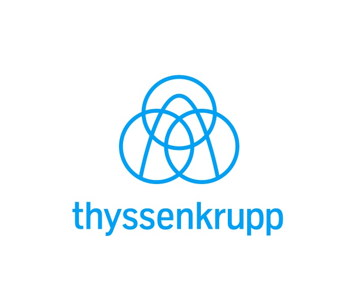
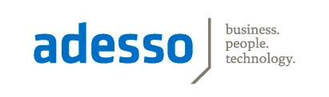

# SAP Inside Track Ruhrpott, May 25th 2019, #sitPOTT

[[TOC]]

## Introduction

On May 25th 2019 the first SAP Inside Track in the Ruhrgebiet (also known as Ruhrpott) will take place in Essen.
We also plan a Code Jam on Friday, 24th of May.

Both, SAP Inside Track and Code Jam are a community events, for all people of the SAP Community, i.e. developers, consultants, customers, freelancers ...
It is organized by members of the community and you can come to listen to great talks or even present your session about a SAP related topic.
And of course it is a great opportunity to meet other members of the community, talk, exchange knowledge and thoughts and make new friends.

The conference language will be English.

## When and how to register? - Sold out! → Waitlist open

The SAP Inside Track Ruhrpott will take place on May 25th 2019. 

Grab your ticket here! (Speakers also have to register)

Register here for #sitPOTT

 

## Where will it take place?

### SAP Inside Track

Topic:          SAP Inside Track

When:         25th of May from  8 am to 7 pm

Where:        thyssenkrupp Quartier – building Q6

                   Thyssenkrupp Allee 1

                   45143 Essen

Google Map Link

Enough parking lots are available.

### Code Jam

Topic:          ABAP Custom Code Migration

Who:           Thomas Fiedler & Ingo Bräuninger 

When:         24th of May from 1 pm to 5 pm

Where:        thyssenkrupp Quartier – building Q2

                   Thyssenkrupp Allee 1

                   45143 Essen

25 attendees

Register here for SAP CodeJam

## Who shall attend?

The Inside Track is from the SAP community for the SAP community: customers, consultants, developers, freelancers, bloggers, nerds and geeks ... - But also for absolute rookies! The important thing of the entire event: share your knowledge, learn great new stuff and gain new buddies.

## Pre-conference event location

Friday 24th of May - Start at 6 pm
Finca & Bar Celona Essen Borbeck
Wüstenhöferstraße 1
45355 Essen Borbeck

## Post-conference event location

Saturday 25th of May - Start at 7 pm
SAUSALITOS Essen am Markt
Am Markt 1
45127 Essen

## Agenda

Preliminary Agenda, as all Slots are filled up

| Agenda | Room A  [Complete Playlist](https://www.youtube.com/playlist?list=PLr7FpxflNYXFQeW1f408DZEUq7eK-dRpR) | Room B  [Complete Playlist](https://www.youtube.com/playlist?list=PLr7FpxflNYXFQeW1f408DZEUq7eK-dRpR)
| --- | --- | ---
| 08:00-09:00 | Registration |  
| 09:00-09:15 | Welcome - [Replay](https://youtu.be/TEsm5MTqMug) |
| 09:30-10:10 | Paul Hardy - All That You Know Is At An End - [Replay](https://youtu.be/aPIbAQwMpQs) | Roland Kramer - Easy Install of SAP IQ database - [Replay](https://youtu.be/yNa6c9cp_wo)
| 10 min      | Break + Networking |
| 10:20-11:00 | Uwe Fetzer - Something with SAP HANA and BEER - [Replay](https://youtu.be/d8eFduYee8A) [Blog Post](https://blogs.sap.com/2019/06/05/sitpott-something-with-hana-and-beer/) on SCN | Volker Stöffler - Windows, Cubes & Rollups: OLAP Extensions in SQL - [Replay](https://youtu.be/_p52J0-Jmuk)
| 30 min      | Break + Networking |
| 11:30-12:10 | Tristan Haupt - ABAP, who are you? - [Replay](https://youtu.be/Q6UTn3BFBRQ)	| Alexander Ziesemer - DSAG SAP Security Survey 2019 – what do the results tell us? - [Replay](https://youtu.be/ZyKR9Q5Dczo)
| 10 min.     | Break + Networking |
| 12:20-13.00 | Fred Verheul - First steps with the Cloud Application Programming Model - [Replay](https://youtu.be/IB7ccA5wOHk) | Marvin Taron, Christian Schmidt - Create apps with UI5 including IoT - [Replay](https://youtu.be/bb2_ALtvbQI)
| 13.00-14:00 | Lunch/Photo |
| 14:00-14:40 | Andre Fischer - ABAP development in SAP Cloud Platform - [Replay](https://youtu.be/fklZSSQMsfQ) | Achim Töper - One Recipe - These are the ingredients for a tasty CI/CD pipeline for SAP - [Replay](https://youtu.be/TrttvMzZyzI)
| 10 min.     | Break + Networking |
| 14:50-15:30 | Thomas Fiedler, Ingo Bräuninger - Copy/Paste & Quick fix your ABAP Code to the Cloud - [Replay](https://youtu.be/CtdpkCMc7-s) | Laurens van Rijn - The Hitchhikers Guide to the Legacy - [Replay](https://youtu.be/KIB2EJxWH-c)
| 30 min      | Break + Networking + Cake |
| 16:00-16:40 | Valentin Chernomaz - From UI- to Unit-Test in SAP ERP without Scripting - [Replay](https://youtu.be/5Lm63ZJewkI) | Juliana Hendel - SAP Activate: reasons to embrace the agile methodology - [Replay](https://youtu.be/VWNE9jt7MM8)
| 10 min      | Break + Networking |
| 16:50-17:30 | Oliver Kohl - Live Streaming Inside Tracks - [Replay](https://youtu.be/m-6JApyITE8) | Anne Johnson - Design Thinking in SAP V.2 - [Replay](https://youtu.be/Qz3HsNi3GcU)
| 17:30-18:00 | Wrap-Up/Speakers/Presents |
| 18:15-19:00 | Drink |

## Sessions suggestions

The call for speakers is now open! Grab your chance and add an interesting talk! The session topics at SAP Inside Tracks are usually technology focused. If possible, the talks should be related to SAP topics...

Please use  Google Forms to add your talk proposal. 
Or press button

Some weeks before the Inside Track the organizing team will vote for the different talks and define a final agenda.

| Speaker (First Last) | Title of Talk | Abstract | Keywords | Add. Information (SCN, Xing, LinkedIn, Twitter, etc.)  Link to Slides
| --- | --- | --- | --- | ---
| ~~Christian Drumm~~ | ~~Hunting Zombies the SCP Way~~ | ~~I'll show a nice integration scenario with an ABAP Backend and the SAP CP.~~ | |
| Volker Stöffler | Windows, Cubes & Rollups: OLAP Extensions in SQL | A core component in Business Intelligence is Online Analytical Processing (OLAP). It is based upon the aggregation of (usually many) rows to a (usually much smaller) result set. The SQL Standard contains some fundamental capabilities (MIN, MAX, AVG, SUM, ... functions, GROUP BY, HAVING) and more advanced functionality is usually provided by applications. But there is an extension to SQL, implemented in SAP products HANA, IQ and SQL Anywhere, which brings more powerful functionality into SQL and the database server itself. With more analytic capabilities closer to the data, there is potential for improvement, especially when dealing with extreme numbers of data rows aka Big Data. Here, I'll introduce basics and principles of these SQL extensions. | OLAP, SQL, Database, Analytics, Database Server, Business Intelligence | [Slides](https://www.db-tecknowledgy.info/fileshare/SAP_InsideTrack/sitPOTT_2019/190526_sitPOTT_OLAP_SQL.pdf) , [Scripts & Statements](https://www.db-tecknowledgy.info/fileshare/SAP_InsideTrack/sitPOTT_2019/Scripts.zip) |
| Volker Stöffler | How to visualize Query Semantics using Open Source [Graphviz](http://www.graphviz.org/) | When analyzing the performance of complex queries, you may find yourself with multi table joins, e.g. generated by a BI system, coded by an out-of-reach developer or evolved through a long life cycle. A semantic query graph visualizes the topology of such a join and helps to understand the options the optimizer has at hand for an execution plan. The graph unveils possible shortcuts or extensions you can provide to enhance query performance by providing additional information to the query optimizer I will demonstrate how to use the Open Source utility Graphviz for visualization. This presentation is based upon ANSI Standard SQL and not restricted to a specific RDBMS implementation. The method is a generic approach to deal with the challenge of understanding and possibly enhancing the topology of a multi table join query. | SQL, Database, RDBMS, Joins, Optimizer, Query Analysis, Query Tuning |
| Uwe Fetzer | Something with beer and HANA	Surprise | Beer, HANA | [Blog Post](https://blogs.sap.com/2019/06/05/sitpott-something-with-hana-and-beer/)  [Git Repository](https://github.com/se38/HANAandBEER)
| Andre Fischer | ABAP development in SAP Cloud Platform | Get the latest Information about programming with ABAP in SAP Cloud Platform. With ABAP being part of SAP Cloud Platform new features are shipped on a bi-weekly basis, so stay tuned. In my talk I will introduce the new ABAP RESTful Programming Model which is available in SAP Cloud Platform ABAP Environment and explain the new concepts such as behavior definition, behavior implementation, service Definition and service binding. In my talk I will show you in several demos how to onboard , how to develop a simple transactional application and how to extend an existing scenario in SAP S/4HANA. | |
| Laurens van Rijn	The Hitchhikers Guide to the Legacy	Bring your towel!	The do’s and dont’s of legacy code	Slides
{ Oliver Kohl | Live Streaming Inside Tracks | Sharing of good practices for live streaming Inside track events, and ideas how to expand the idea in the future | | [Slides](https://www.slideshare.net/OliverKohl/live-streaming-sap-inside-tracks)
| Volker Stöffler | SQL Anywhere - from DBoT to Enterprise IT | Starting from Embedded Databases for the Internet of Things, scaling up to Site or Work Group Level and integrating with Enterprise Level IT infrastructure, SAP SQL Anywhere is a standard compliant and full feature database server. This session introduces capabilities and characteristics of this unsung hero in the SAP portfolio and shows matching use cases, architecture and topology. | Database, SQL, IoT |
| Valentin Chernomaz | From UI- to Unit-Test in SAP ERP without Scripting | In the SAP® ERP environment, you face challenges specific to SAP® when building automated tests. In this talk, we share with you our experience in automating the testing of our RT.easy products and why we ultimately chose to develop our own TEST.easy solution. We will talk about: - Typical problems with test automation in the SAP environments - Testing of customer enhancements and in-house developments - Requirements for test tools - Cost reduction
| Paul Hardy | All That You Know Is At An End| The pace of change in the ABAP world has never been faster. The two seismic changes at the moment are abapGit and the RESTful ABAP Programming model. I have been involved in both and will share with you all the non-secret things I can, to give you a glimpse into the Utopian future of ABAP programming. | | [Slides](https://drive.google.com/file/d/1RziOxqieDqkr2iKJ2n9TctLDuW-6_wu7/view)
| Roland Kramer  @sapfirstguidance | Hitchhiker's Guide to SAP NetWeaver | SAP goes Cloud, SAP Analytics Cloud, Cloud for Applications, IaaS, SaaS, PaaS, HaaS, etc, etc. Since several Years everyone talks about the digital transformation and the intelligent enterprise into the Cloud, but the most of our SAP Customers running their mission critical system still „on-premise“. With this Presentation we take a step back to give a glimpse of the SAP NetWeaver evolution, of course without kubernetics, containers, block chains, IoT but everything on the foundation for the countless ABAP Programmers. See also the wise and not so wise decision of the past 1 ½ decades in the SAP history of the SAP Application Platform with a twinkle in the eye. | SAP First Guidance | Related SCN Blog [Blog - SL for BW(/4)](https://blogs.sap.com/2016/10/11/software-application-lifecycle-management-sap-bw/)
| Roland Kramer  @RolandKramer  @sapfirstguidance | Q - the easy Installer of SAP IQ database | Creating a SAP IQ can be as easy as filling three values in a little HTML page. Since the acquisition of the Sybase company in 2013, the SAP Application Portfolio was enhanced with the most modern and reliable database, event streaming and replication technology at all time. Nevertheless, the implementation of the „real big data storage“ called IQ was never in the priority of the SAP automation efforts. With this Presentation you will see, how everyone can create a SAP IQ database based on the SAP Host Agent interface to support all kind of solutions like SAP-NLS, native IQ Big Data solutions, or hot/hot frozen concept for BW/4HANA | SAP First Guidance | Related SCN [Blog - SAP-NLS](https://blogs.sap.com/2016/10/12/sap-nls-solution-sap-bw/) new [Blog: Q- the easy SAP Sybase IQ Installer](https://blogs.sap.com/2019/05/22/q-the-easy-installer-for-sap-iq/)
| Achim Toeper | One Recipe - These are the ingredients for a tasty CI/CD pipeline for SAP | Many people think that #DevOps and #Agile do not work in SAP. We are convinced that this is no longer possible without it. The basics are explained using practical ingredients and examples are given of how to rethink one's own attitude (culture) and ask the right questions in order to approach the appropriate agile direction in the manner of an assessment. Then I show examples of how the ingredients work for an agile composition. For those who finally want to get on the agile path, I have recipes for a DevOps learning trip ready. | DevOps / Agile Pipeline Continuous Integration CALMS / SAFE Automation Robotic Test Automation Culture / Lean | @elominas
| Marvin Taron, Christian Schmidt | Create apps with UI5 including IoT | tba | |
| Tristan Haupt | ABAP, who are you? | A beginners journey to ABAP coding. Details will follow soon. | |
| Fred Verheul | First steps with the Cloud Application Programming Model | We'll take a look at the new Cloud Application Programming Model that SAP introduced last year, and which should make it easier for developers to get started developing applications on SAP Cloud Platform CloudFoundry. | | No slides! </brTo find out more about Cloud Application Programming Model better please Google it, or go to the Community or Developer pages.
| Dr. Alexander Ziesemer | DSAG SAP Security Survey 2019 – what do the results tell us? | This session will present some results and the key insights gotten from the latest survey on SAP security that has been conducted by the DSAG by end of 2018 (DSAG: German-speaking SAP user group, Germany, Austria and Switzerland, is with more than sixty-thousand members one of the most influencing user group worldwide). In this survey, DSAG asked their members: Which topics in the SAP security domain are most important for SAP customers? Is assistance by SAP in these matters sufficient – and if not, what exactly is missing? What differences can be found compared to the survey from the year before, are there any trends to observe? What are the key messages from customers, including high-priority requirements for SAP products, software and services that can be inferred from the survey’s results? Finally we want to discuss whether some of the pain points highlighted have already been addressed or/and implemented in the last months and which top-most issues are still open. | |
| Thomas Fiedler, Ingo Bräuninger | Copy/Paste & Quick fix your ABAP Code to the Cloud | The benefit of the ABAP environment in SAP Cloud Platform is that you can reuse existing ABAP Code in the Cloud. I will show you what you have to consider that your code is cloud-ready and how you can transfer the code to the cloud. There are well known friends involved in the talk like ADT, abapGit and ATC. | |
| Juliana Hendel | SAP Activate: reasons to embrace the agile methodology | “ We often hear that SAP Activate is an agile methodology for SAP implementations, but many have their reservations about how agile it actually is. SAP Activate takes the best of both worlds, waterfall and agile approaches, while remaining agile at the core. This session discusses the main aspects of what makes SAP Activate a unique and effective approach to project implementation.” | |
| Anne Johnson | Design Thinking in SAP V.2 | An iteration on "A detectives tale into sap design thinking" - Deep dive into where and how DT fits with SAP - and how it can be aqquired into the business culture - what skills and framework the Business needs to benefit from Design Thinking | |

## Participants *

| First Name | Last Name | Bio | Twitter | Fri - PreEvening Y/N | Sat - PostEvening Y/N
| --- | --- | --- | --- | --- | ---
| Roland | Knipp | | sbasischeck | Y | Y
| Dominik | Di Lorenzo | | ddevx | M | M
| Fabian | Lupa | | Fabian_Lupa | M | M
| Jens | Knappik | | Jens_Knappik | M | M
| Hannah | Knipp | | | N | Y
| Maximilian | Bächli | |  m_baechli | M | M
| Gregor | Wolf | | wolf_gregor | M | N
| Patrick | Tenhaken | | | M | M
| Anette | Grosser | | ag_con | N | N
| Kien Weng | Chan | [LinkedIn](https://www.linkedin.com/in/kien-weng-chan-6277b555/) | | M | M
| Frank | Nawrath | | ruetergat | Y | Y
| Sören | Schlegel | | SoSchlegel87 | Y | M
| Carsten | Schröder | | | M | M
| Volker | Baum | | | M | M
| Cemal | Aslan | | cemal00 | M | Y
| Paul | Hardy | | hardyp180 | Y | Y
| Uwe	| Fetzer | | se38 | N | N
| René | Thimel | | renethimel | Y | Y
| Fred | Verheul | | fredverheul | N | N
| Christoph | Lordieck | | | M | N
| Volker | Stöffler | [LinkedIn](https://de.linkedin.com/in/dbtecknowledgy) | | Y | Y
| Babu | Kilari | | babukilari | M | N
| ~~Stephan~~ | ~~Thies~~ | | ~~Steph_Thies~~ | ~~M~~ | ~~M~~
| Amol | Gupta | | | |
| Carsten | Trescher | | | M | M
| Armin | Karic | | | Y | Y
| Alexander | Groschel Schulz | | | |
| Marva | Alshwaiki | [LinkedIn](https://www.linkedin.com/in/marwah-al-shwaiki-036948136/) | | M | M
| Matthias| Dohmen | | | N | N
| Julia | Küpper | | | M | M
| Darshil | Shah | | | M | M
| Andreas | Profitlich | | | N | N
| Ganesh | Chandorkar | | | Y | Y
| Timm-Pierre | Dusemund | | timm_du | M | M
| ~~Benedikt~~ | ~~Kremer~~ | | | ~~M~~ | ~~N~~
| Douglas | Kuchler | | douglas_erp | M | M
| Anne | Johnson | [LinkedIn](https://www.linkedin.com/in/anne-johnson-sap/) | artisticspasm | N | M
| Valentin | Chernomaz | | | M | M
| Thomas | Luxa | | | M | M
| Tristan | Haupt | | | M | M
| Michael | Kempe | | TheKempe | N | M
| Andreas | Murschall | | | Y | Y
| Marvin | Taron | | | |
| Josef | Bieschin | | | |
| ilyas | Bozhüyük | | | Y | Y
| Dorina | Rehlender | | | Y | N
| Haolin | Zhi | | haolin_zhi | Y | M
| Gaurav | Wani | | | M | M
| Torsten | Schubert | | weltspion | Y | Y
| Irina | Nikulina | | | |
| Ullrich | Platt | | | M | Y
| Umut | Er | | | M | M
| Robert | Hunger | | | M | M
| Martin | Kuhlmann | | | Y | M
| Ingo | Bräuninger | | ibraeuninger | |
| Achim | Toeper | | elominas | |
| Andre | Fischer | | anfisc | |
| Roland | Kramer | [LinkedIn](https://www.linkedin.com/in/rolandkramer) | rolandkramer | Y | Y
| Laurens | van Rijn | | laurensvanrijn | N | Y
| Christian | Schmidt | | | |
| Oliver | Kohl | | oliver | Y | Y
| Dr. Alexander | Ziesemer | | | |
| Thomas | Fiedler | | ThFiedler | |
| Juliana | Hendel | | | |
| Bettina | Knipp | | | |
| Dennis | Terhoeven | | un_kreativer | N | M

*New Registration is only valid using the sitreg app. Please do not insert any new participant!

## Costs

There will be no costs for participants for the conference and code jam.

The pre- and post-conference events are not for free. (Everybody pays his own drinks & food)

## Social Media

Twitter Hashtag: #sitPOTT

## Hotel suggestions

[McDreams Hotel](https://www.mcdreamshotels.de/hotel-essen-city.html)

[Holiday Inn Express](https://www.ihg.com/holidayinnexpress/hotels/gb/en/essen/essdl/hoteldetail) 

## Sponsors

A huge "Thank you!" to our sponsors:

.gif)

We are looking for sponsors. If you like to support us don't hesitate to contact us.
Contact details can be found below.

> [insidetrack.pott@gmail.com](mailto:insidetrack.pott@gmail.com).

For sponsors we offer the following:

- Your logo on the SAP Community Network Space for SAP Inside Tracks
- You will be mentioned during the opening and closing sessions of the conference
- At the event, you can put some flyer and merchandising to one of the desks. Please no rollups.

And the best of all, by sending your employees to the conference, you'll have the opportunity to get in contact with plenty of highly motivated SAP experts.

## Contact

If you have any questions, feedback or other topics, you can always contact us through email address [insidetrack.pott@gmail.com](mailto:insidetrack.pott@gmail.com).

## Organizational Team

Andreas Profiltlich

Jens Knappik

Roland Knipp

Rene Thimel

Fabian Lupa

Dominik Di Lorenzo 