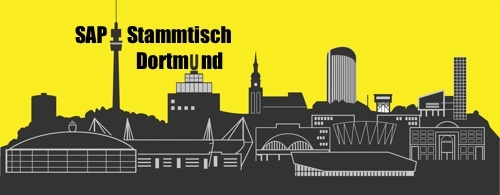

## Willkommen zu den öffentlichen Ressourcen vom SAP Stammtisch Dortmund

Treffen der SAP Community aus Dortmund und Umgebung

[SAP Community SCN Webseite](https://wiki.scn.sap.com/wiki/display/events/SAP+Stammtisch+Dortmund) sowie [Xing Gruppe SAP Stammtisch Dortmund](https://www.xing.com/communities/groups/sap-stammtisch-dortmund-1095503)

### UPDATE

In der aktuellen Situation findet der SAP Stammtisch virtuell statt!

### SAP Stammtisch Dortmund

Der SAP Stammtisch Dortmund ist ein regelmäßiges Treffen der lokalen SAP Community.
Egal, welches Modul Ihr betreut, egal ob Entwickler, Administrator, Anwender oder Berater, alle sind herzlich eingeladen.
Der Erfahrungsaustausch rund um SAP wie auch alle Nicht-SAP-Themen steht im Mittelpunkt.

Als Ort haben wir uns die Hövels Brauerei ausgewählt, direkt neben der Thiergalerie.

### Aktuelles - Nächstes Treffen
 
> Termin: Mittwoch, 10.02.2021 ab 20 Uhr  

[Anmeldedetails](https://wiki.scn.sap.com/wiki/display/events/SAP+Stammtisch+Dortmund)

### SAP Inside Track

Event gecancelt: Samstag, 06.06.2020, wir unterstützen den [SAP Inside Track Ruhrpott](https://wiki.scn.sap.com/wiki/display/events/SAP+Inside+Track+Ruhrpott%2C+June+6th+2020%2C+%23sitPOTT+-+CANCELLED) und sind auch mit dabei

### Ressourcen-Archiv

#### SAP Inside Track 2019

- Samstag, 25.05.2019 SAP Inside Track RuhrPOTT in Essen  
  Präsentationen: SAP SCN Wiki Seite [SAP Inside Track RuhrPOTT #sitPOTT](https://wiki.scn.sap.com/wiki/display/events/SAP+Inside+Track+Ruhrpott%2C+May+25th+2019%2C+%23sitPOTT)  
  Live Recordings: YouTube Channel [SAP Inside Track sitPOTT](https://www.youtube.com/channel/UCuquqxaHNQhdi2cfaFcqtkw)

### Archiv Bisherige Stammtisch Treffen

#### 2020
- Mittwoch, 25.11.2020 ab 20 Uhr (virtuell)
- Dienstag, 27.10.2020 ab 20 Uhr (virtuell, zusammen mit [SAP Stammtisch Bern](https://wiki.scn.sap.com/wiki/display/events/SAP+Stammtisch+Bern+und+virtuell+Schweiz))
- Dienstag, 22.09.2020 ab 19h (Hövels Brauerei)
- Dienstag, 09.06.2020 ab 20h (virtuell)
- Mittwoch, 13.05.2020 ab 19h (virtuell)
- Mittwoch, 29.04.2020 ab 19h (virtuell)
- Dienstag, 10.03.2020 ab 19h (Hövels Brauerei)
- Mittwoch, 19.02.2020 ab 19h (Hövels Brauerei)
- Dienstag, 14.01.2020 ab 19h (Hövels Brauerei)

#### 2019
- Mittwoch, 11.12.2019 ab 19h
- Dienstag, 12.11.2019 ab 19h
- Mittwoch, 16.10.2019 ab 19h
- Mittwoch, 14.08.2019 ab 19h
- Mittwoch, 10.07.2019 ab 19h
- Mittwoch, 12.06.2019 ab 10h
- Mittwoch, 08.05.2019 ab 19h
- Mittwoch, 10.04.2019 ab 19h
- Dienstag, 12.03.2019 ab 19h
- Dienstag, 19.01.2019 ab 19h

#### 2018
- Mittwoch, 13.12.2018 ab 19h
- Dienstag, 13.11.2018 ab 19h
- Mittwoch, 19.09.2018 ab 19h
- Dienstag, 14.08.2018 ab 19h
- Dienstag, 12.06.2018 ab 19h
- Dienstag, 08.05.2018 ab 19h
- Dienstag, 17.04.2018 ab 19h
- Dienstag, 13.03.2018 ab 19h
- Dienstag, 13.02.2018 ab 19h
- Dienstag, 16.01.2018 ab 19h

#### 2017
- Dienstag, 12.12.2017 ab 19h
- Dienstag, 17.11.2017 ab 19h
- Dienstag, 10.10.2017 ab 19h
- Dienstag, 12.09.2017 ab 19h
- Dienstag, 15.08.2017 ab 19h
- Dienstag, 11.07.2017 ab 19h
- Mittwoch, 14.06.2017 ab 19h
- Mittwoch, 10.05.2017 ab 19h
- Mittwoch, 12.04.2017 ab 19h
