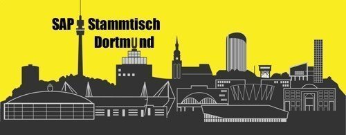

## SAP Stammtisch Dortmund / Community Meetup Dortmund

_Treffen der lokalen SAP Community aus Dortmund und Umgebung_

Der SAP Stammtisch Dortmund ist ein regelmäßiges informelles Treffen der lokalen SAP Community. Eingeladen ist jeder, der Lust und Zeit hat, unabhängig vom fachlichen Hintergrund, von Entwickler, Berater, Projekt Manager, Basis Administrator bis hin zum Endanwender.

Im Mittelpunkt steht ein lockerer fachlicher Austausch rund um SAP-Themen über Unternehmensgrenzen hinweg.

## Impressionen



## Nächstes Treffen

> __🎄Weihnachtsmarkt Edition🎄__  
  Termin: __12.12.2024, 18:30 Uhr__  
  Ort: Treffpunkt an der [Hövels Brauerei](http://www.hoevels-hausbrauerei.de/)  
  Hoher Wall 5-7  
  44135 Dortmund  
  [Route](https://www.google.de/maps/dir//H%C3%96VELS+Hausbrauerei,+Hoher+Wall,+Dortmund/@51.5124745,7.4240223,13z/data=!3m1!5s0x47b919e12d5f025d:0x7edf0a3a3f00b3e0!4m8!4m7!1m0!1m5!1m1!1s0x47b919e728aabbaf:0xd525f834865885a0!2m2!1d7.4590415!2d51.5124263?hl=de)

## Anmeldung

Melde dich idealerweise im Voraus zu den Terminen an, damit wir entsprechend planen und reservieren können. Du kannst dies über die Event-Posts auf [LinkedIn](https://www.linkedin.com/groups/13062692/) oder der [SAP Community Location Group Dortmund](https://community.sap.com/t5/dortmund/gh-p/dortmund) tun oder dich einfach direkt bei einem der unter [Organisatoren](#organisatoren) verlinkten Ansprechpartnern melden.

Spontane Teilnahmen sind natürlich auch gerne gesehen!

## Organisatoren

Der Stammtisch wird von Fabian und Patrick organisiert. Melde dich bei Fragen oder sonstigen Anliegen gerne bei uns.



Alternativ kannst du auch Kontakt über [sap.stammtisch@gmail.com](mailto:sap.stammtisch@gmail.com) aufnehmen.

## SAP Stammtisch Dortmund auf Social Media



## SAP Inside Track RuhrPOTT #sitPOTT

Ein SAP Inside Track (SIT) ist eine lokale Veranstaltung, bei der sich Mitglieder der SAP-Community treffen, um Wissen über SAP-bezogene Themen auszutauschen. Die Veranstaltung lebt von dem Austausch der Community, wird von ihr organisiert, ist kostengünstig, oft gesponsert oder sogar kostenlos und sehr informell. Jeder, der Interesse hat, kann daran teilnehmen.

wir unterstützen den  
[SAP Inside Track Ruhrpott](https://wiki.scn.sap.com/wiki/display/events/SAP+Inside+Track+Ruhrpott%2C+June+6th+2020%2C+%23sitPOTT+-+CANCELLED)  
und sind auch mit dabei

- ~~06.06.2020 (Samstag)~~, _SAP Inside Track RuhrPOTT #sitPOTT_ *cancelled*

- 25.05.2019 (Samstag),  __SAP Inside Track RuhrPOTT #sitPOTT in Essen__  
  Präsentationen: SAP SCN Wiki Seite  
  [SAP Inside Track RuhrPOTT #sitPOTT](2019-sitPOTT.md)  
  Live Recordings: YouTube Channel  
  [SAP Inside Track sitPOTT](https://www.youtube.com/channel/UCuquqxaHNQhdi2cfaFcqtkw)

## Archiv

| Datum | Uhrzeit | Ort |
|-------|---------|-----|
| __2024__ | | |
| 07.11.2024 (Donnerstag) | 18:30 | Zum Alten Markt |
| 05.09.2024 (Donnerstag) | 18:30 | Zum Alten Markt |
| 11.07.2024 (Donnerstag) | 18:30 | Hövels Brauerei |
| 28.05.2024 (Dienstag) | 18:00 | Hövels Brauerei |
| 09.04.2024 (Dienstag) | 19:00 | Hövels Brauerei |
| 05.03.2024 (Dienstag) | 19:00 | Hövels Brauerei |
| __2023__ | | |
| 18.10.2023 (Mittwoch) | 19:00 | Hövels Brauerei |
| 16.08.2023 (Mittwoch) | 19:00 | Hövels Brauerei |
| 24.05.2023 (Mittwoch) | 19:00 | Hövels Brauerei |
| 21.02.2023 (Dienstag) | ab 20:00 | virtuell, zusammen mit [SAP Stammtisch Bern](https://sapstammtisch.github.io/Bern/) |
| 24.01.2023 (Dienstag) | ab 20:00 | virtuell, zusammen mit [SAP Stammtisch Bern](https://sapstammtisch.github.io/Bern/) |
| __2022__ | | |
| 15./16.11.2022 | ab 18h | SAP TechEd Special: #SAPStammtischTechEdWorkspace zusammen mit [SAP Stammtisch Bern](https://sapstammtisch.github.io/Bern/) |
| 25.10.2022 (Dienstag) | ab 20:00 | virtuell, zusammen mit [SAP Stammtisch Bern](https://sapstammtisch.github.io/Bern/) |
| 19.10.2022 (Mittwoch) | ab 19:00 | Hövels Brauerei |
| 28.09.2022 (Mittwoch) | ab 19:00 | Hövels Brauerei |
| 20.09.2022 (Dienstag) | ab 20:00 | virtuell, zusammen mit [SAP Stammtisch Bern](https://sapstammtisch.github.io/Bern/) |
| 23.08.2022 (Dienstag) | ab 20:00 | virtuell, zusammen mit [SAP Stammtisch Bern](https://sapstammtisch.github.io/Bern/) |
| 17.08.2022 (Mittwoch) | ab 19:00 | Hövels Brauerei |
| 24.05.2022 (Dienstag) | ab 19:00 | Hövels Brauerei |
| 17.05.2022 (Dienstag) | ab 20:00 | virtuell, zusammen mit [SAP Stammtisch Bern](https://sapstammtisch.github.io/Bern/) |
| 26.04.2022 (Dienstag) | ab 20:00 | virtuell, zusammen mit [SAP Stammtisch Bern](https://sapstammtisch.github.io/Bern/) **Jubiläums-Stammtisch Nr. 50** |
| 23.03.2022 (Mittwoch) | ab 19:00 | Hövels Brauerei |
| 22.03.2022 (Dienstag) | ab 20:00 | virtuell, zusammen mit [SAP Stammtisch Bern](https://sapstammtisch.github.io/Bern/) |
| __2021__ | | |
| 14.12.2021 (Dienstag) | ab 20:00 | virtuell |
| 10.11.2021 (Mittwoch) | ab 20:00 | virtuell |
| 13.10.2021 (Mittwoch) | ab 20:00 | virtuell |
| 20.07.2021 (Dienstag) | ab 20:00 | virtuell |
| 09.06.2021 (Mittwoch) | ab 20:00 | virtuell |
| 19.05.2021 (Mittwoch) | ab 20:00 | virtuell, zusammen mit [SAP Stammtisch Bern](https://wiki.scn.sap.com/wiki/display/events/SAP+Stammtisch+Bern+und+virtuell+Schweiz) |
| 07.04.2021 (Mittwoch) | ab 20:00 | virtuell |
| 10.03.2021 (Mittwoch) | ab 20:00 | virtuell |
| 10.02.2021 (Mittwoch) | ab 20:00 | virtuell |
| __2020__ | | |
| 25.11.2020 (Mittwoch) | ab 20:00 | virtuell |
| 27.10.2020 (Dienstag) | ab 20:00 | virtuell, zusammen mit [SAP Stammtisch Bern](https://wiki.scn.sap.com/wiki/display/events/SAP+Stammtisch+Bern+und+virtuell+Schweiz) |
| 22.09.2020 (Dienstag) | ab 19:00 | Hövels Brauerei |
| 09.06.2020 (Dienstag) | ab 20:00 | virtuell |
| 13.05.2020 (Mittwoch) | ab 19:00 | virtuell |
| 29.04.2020 (Mittwoch) | ab 19:00 | virtuell |
| 10.03.2020 (Dienstag) | ab 19:00 | Hövels Brauerei |
| 19.02.2020 (Mittwoch) | ab 19:00 | Hövels Brauerei |
| 14.01.2020 (Dienstag) | ab 19:00 | Hövels Brauerei |
| __2019__ | | |
| 11.12.2019 (Mittwoch) | ab 19:00 | |
| 12.11.2019 (Dienstag) | ab 19:00 | |
| 16.10.2019 (Mittwoch) | ab 19:00 | |
| 14.08.2019 (Mittwoch) | ab 19:00 | |
| 10.07.2019 (Mittwoch) | ab 19:00 | |
| 12.06.2019 (Mittwoch) | ab 10:00 | |
| 08.05.2019 (Mittwoch) | ab 19:00 | |
| 10.04.2019 (Mittwoch) | ab 19:00 | |
| 12.03.2019 (Dienstag) | ab 19:00 | |
| 19.01.2019 (Dienstag) | ab 19:00 | |
| __2018__ | | |
| 13.12.2018 (Mittwoch) | ab 19:00 | |
| 13.11.2018 (Dienstag) | ab 19:00 | |
| 19.09.2018 (Mittwoch) | ab 19:00 | |
| 14.08.2018 (Dienstag) | ab 19:00 | |
| 12.06.2018 (Dienstag) | ab 19:00 | |
| 08.05.2018 (Dienstag) | ab 19:00 | |
| 17.04.2018 (Dienstag) | ab 19:00 | |
| 13.03.2018 (Dienstag) | ab 19:00 | |
| 13.02.2018 (Dienstag) | ab 19:00 | |
| 16.01.2018 (Dienstag) | ab 19:00 | |
| __2017__ | | |
| 12.12.2017 (Dienstag) | ab 19:00 | |
| 17.11.2017 (Dienstag) | ab 19:00 | |
| 10.10.2017 (Dienstag) | ab 19:00 | |
| 12.09.2017 (Dienstag) | ab 19:00 | |
| 15.08.2017 (Dienstag) | ab 19:00 | |
| 11.07.2017 (Dienstag) | ab 19:00 | |
| 14.06.2017 (Mittwoch) | ab 19:00 | |
| 10.05.2017 (Mittwoch) | ab 19:00 | |
| 12.04.2017 (Mittwoch) | ab 19:00 | |
