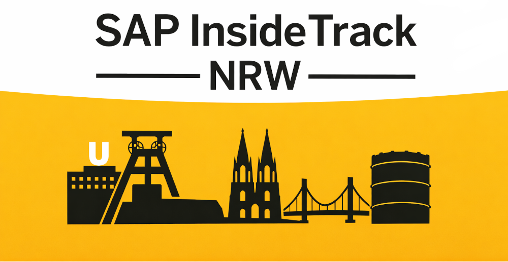

 

## Introduction

We’re bringing a regional SAP Inside Track back to NRW (North-Rhine-Westphalia), and we’d love to see you there. After the memorable sitPOTT from soon to be 7 years ago, it’s time to revive that spirit of learning, networking, and hands on exchange. SAP Inside Track NRW will be a day shaped by the community: practical sessions, real project insights, and plenty of opportunities to connect with people who work with SAP technologies every day.

What to expect:
- A full day of sessions from community speakers
- Space for discussions, questions, and sharing your own experiences
- A relaxed atmosphere — no suits required
- Networking with familiar faces and new ones

## Event Details

<i class="fa-solid fa-calendar"></i> **Date:** June 13, 2026  
<i class="fa-solid fa-location-dot"></i> **Location:** On-site at adesso Dortmund ([Freie-Vogel-Straße 383, 44269 Dortmund](https://maps.app.goo.gl/2zBxo52QkLNXmA39A))  
<i class="fa-solid fa-money-bill-1-wave"></i> **Admission:** Free (registration required)  
<i class="fa-solid fa-ticket"></i> **Registration:** [here](#registration)

Also check out our [CodeJam](#codejam), [pre-event](#pre-event) and [post-event](#post-event).

## Registration

Here you can register for the main event as well as the [pre-event](#pre-event) and [post-event](#post-event).

[Register here](https://ti.to/sap-inside-track-nrw/sap-inside-track-2026){: .btn .btn--info }

## Agenda

| Start time | End time | Topic | Speaker |
| --- | --- | --- | --- |
| 08:30 | 09:00 | Meet & Greet |  |
| 09:00 | 09:15 | Opening | Fabian, Björn, Holger, Patrick |
| 09:15 | 09:30 | SAP Community ([Slides](/assets/What%20is%20the%20SAP%20Community_SAP%20Inside%20Track%20NRW%202026.pdf)) | Laura Schmitz |
| 09:30 | 09:50 | Business Objects in ABAP Cloud - A practical Introduction to RAP | Victor Fibechola Okpanachi |
| 09:50 | 10:00 | Coffee & Talk |  |
| 10:00 | 10:40 | What's new in RAP? ([Slides](/assets/What‘s%20new%20in%20RAP%20-%202605.pdf)) | Andre Fischer |
| 10:45 | 11:25 | Building Modern CAP Applications with Best Practices & AI | Daniel Schlachter, Christian Georgi, Birgit Selbach |
| 11:30 | 13:00 | Photo + Lunch + Networking |  |
| 13:00 | 13:40 | Documents in Fiori Apps - HDM-ready or not | Karin Meyer |
| 13:45 | 14:25 | AI-Powered Full-Stack Development with SAP's MCP Server for ABAP & Fiori ([Slides](/assets/InsideNRW_13062026.pdf)) | Sebastian Werner, Andre Fischer, Christoph Gollmick |
| 14:25 | 14:40 | Coffee & Talk |  |
| 14:45 | 15:25 | The BTP Apps you didn't know you had: Post-Breach detection with cloud audit ([Slides](/assets/Sentinel-BTP-SIT-Dortmund-2026.pdf)) | Martin Pankraz |
| 15:30 | 16:10 | Learning from migrations from SAP PO to SAP Integration Suite | Jeroen Knops |
| 16:15 | 16:45 | Nice Template! Can We Buy It? - The Reality of Turning a SaaS solution for German Utilities into a Product ([Slides](/assets/20260613_SAP_Inside_Track_NRW.pdf)) | Christopher Graw |
| 16:45 | 17:00 | Closing | Fabian, Björn, Holger, Patrick |
| 18:00 | Open-End | Aftershowparty |  |

## Related Events

### CodeJam

<i class="fa-solid fa-hashtag"></i> **Topic:** ABAP Cloud and the ABAP RESTful Application Programming Model  
<i class="fa-solid fa-person-chalkboard"></i> **Instructor:** Andre Fischer  
<i class="fa-solid fa-calendar"></i> **Date:** June 12, 2026  
<i class="fa-solid fa-alarm-clock"></i> **Time:** 10:00 - 16:00  
<i class="fa-solid fa-location-dot"></i> **Location:** On-site at UNIORG Dortmund ([Lissaboner Allee 6-8, 44269 Dortmund](https://maps.app.goo.gl/S8NkU8z3uNwK3c5q8))  
<i class="fa-solid fa-money-bill-1-wave"></i> **Admission:** Free (registration required and seats are limited)  
<i class="fa-solid fa-ticket"></i> **Registration:** [register here](https://community.sap.com/t5/sap-codejam/sap-codejam-abap-cloud-dortmund-germany/ev-p/14384238)

### Pre-Event

<i class="fa-solid fa-people-group"></i> **Event:** SAP Stammtisch Dortmund & Cologne/Düsseldorf  
<i class="fa-solid fa-calendar"></i> **Date:** June 12, 2026  
<i class="fa-solid fa-alarm-clock"></i> **Time:** 18:00 - 21:00 CET  
<i class="fa-solid fa-location-dot"></i> **Location:** HÖVELS Hausbrauerei Dortmund ([Hoher Wall 5-7, 44137 Dortmund](https://maps.app.goo.gl/WYDp7nSBtm4AEx6fA))  
<i class="fa-solid fa-money-bill-1-wave"></i> **Admission:** Everyone pays for their own food and drinks  
<i class="fa-solid fa-ticket"></i> **Registration:** [register as part of your sitNRW registration](#registration)

### Post-Event

<i class="fa-solid fa-people-group"></i> **Event:** sitNRW 2026 Afterparty  
<i class="fa-solid fa-calendar"></i> **Date:** June 13, 2026  
<i class="fa-solid fa-alarm-clock"></i> **Time:** 18:00 - Open End  
<i class="fa-solid fa-location-dot"></i> **Location:** The ASH Dortmund ([Europapl. 3, 44269 Dortmund](https://maps.app.goo.gl/DQLdoXw8dhTo6tpb6))  
<i class="fa-solid fa-money-bill-1-wave"></i> **Admission:** Everyone pays for their own food and drinks  
<i class="fa-solid fa-ticket"></i> **Registration:** [register as part of your sitNRW registration](#registration)

## Blog Posts

- Announcement Post
  - [Announcement Post SAP Community Dortmund](https://community.sap.com/t5/dortmund-blog-posts/announcement-sap-inside-track-nrw-be-part-of-nrw-s-biggest-sap-event-in/ba-p/14299356)
  - [Announcement Post SAP Community Cologne/Düsseldorf](https://community.sap.com/t5/d%C3%BCsseldorf-k%C3%B6ln-blog-posts/sap-inside-track-nrw/ba-p/14305495)
- Call for Speakers
  - [Call for Speakers SAP Community Dortmund](https://community.sap.com/t5/dortmund-blog-posts/call-for-speakers-sap-inside-track-nrw/ba-p/14299358)
  - [Call for Speakers SAP Community Cologne/Düsseldorf](https://community.sap.com/t5/d%C3%BCsseldorf-k%C3%B6ln-blog-posts/call-for-speakers-sap-inside-track-nrw/ba-p/14305500)
- Registration
  - [Registration SAP Community Dortmund](https://community.sap.com/t5/dortmund-blog-posts/sap-inside-track-nrw-registration/ba-p/14371138)
  - [Registration SAP Community Cologne/Düsseldorf](https://community.sap.com/t5/d%C3%BCsseldorf-k%C3%B6ln-blog-posts/sap-inside-track-nrw-registration/ba-p/14371139)

## Organizers



